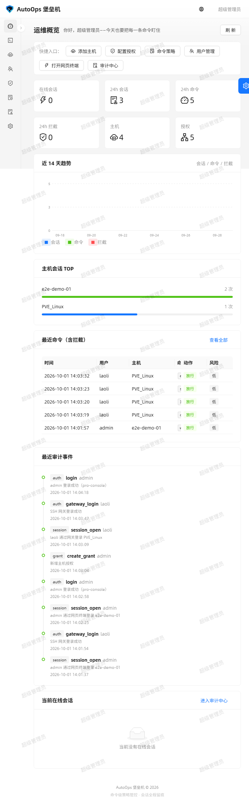
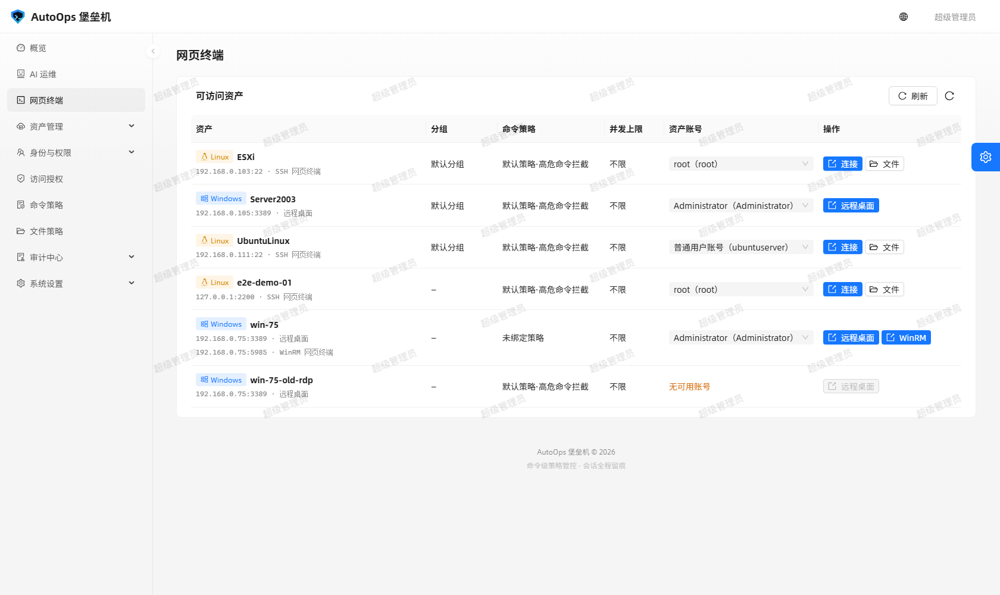
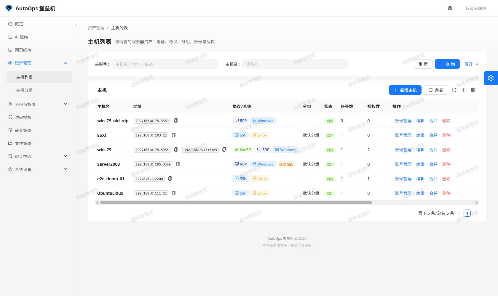
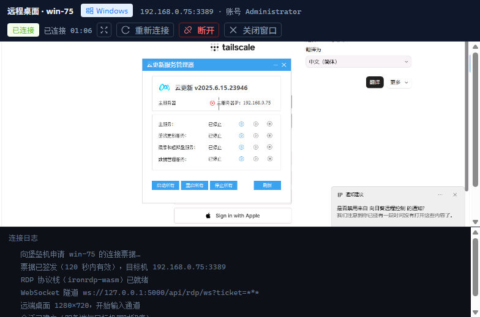
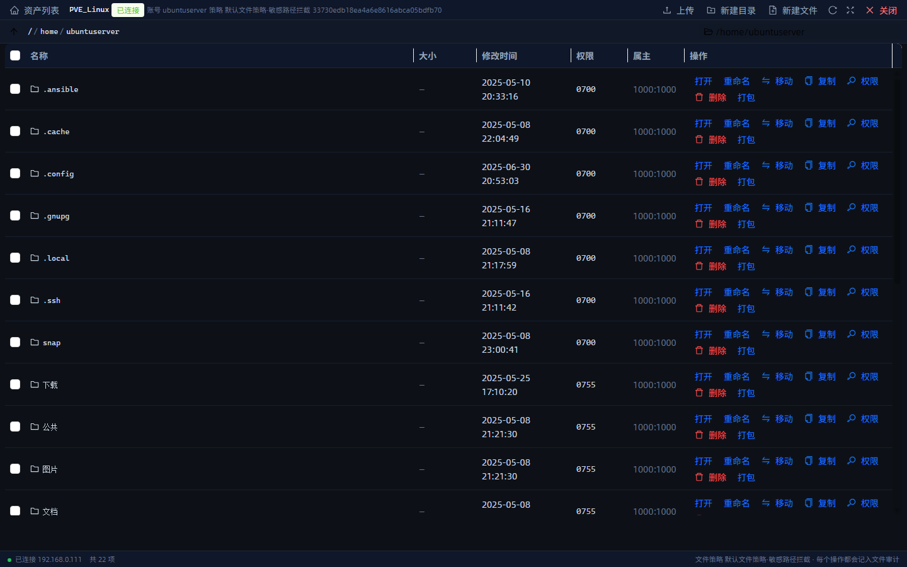
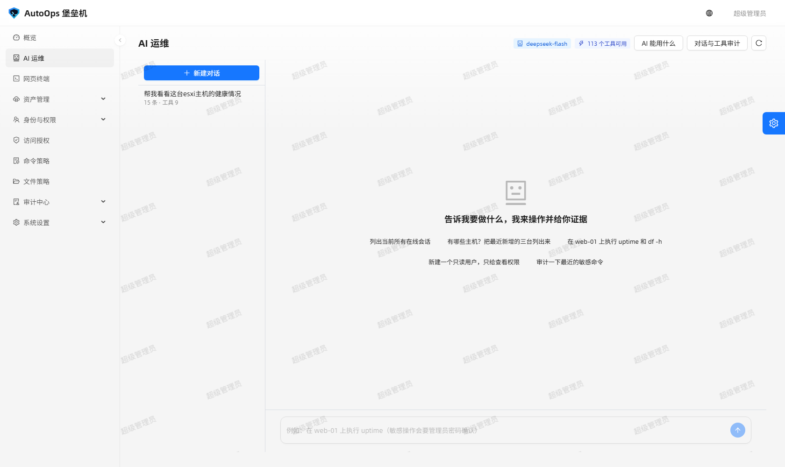
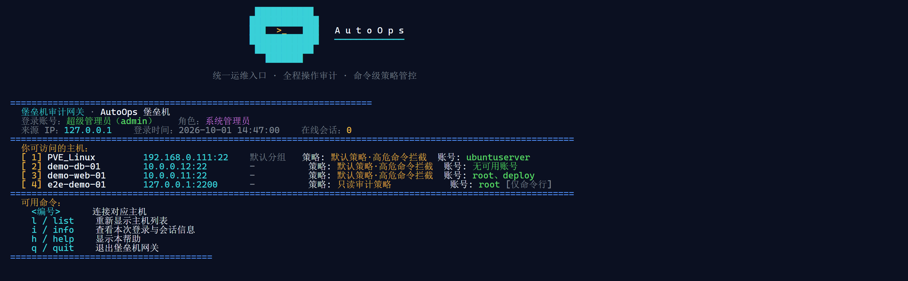
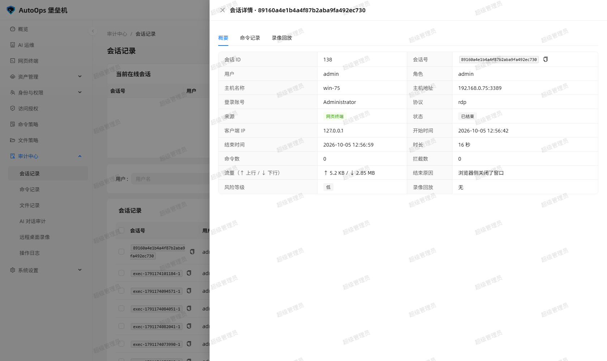

<h1 align="center">AutoOps 堡垒机</h1>

<p align="center">把「谁能连哪台机器、能用哪个账号、能敲什么命令」全管住的开源运维堡垒机</p>

<p align="center">
  <a href="LICENSE"></a>
  
  
  
  
  
</p>

<p align="center">
  <b>中文</b> · <a href="docs/i18n/README.en.md">English</a>
</p>

> **很高兴认识你，陌生人！** 我是一名初二学生，在中国新疆读初中。英语和写的代码都还在慢慢练，
> 这份项目说明里要是有写得不够好的地方，请大家多多谅解，也欢迎直接指正。
>
> **Nice to meet you, stranger!** I'm an eighth-grade student in Xinjiang, China. My English and my
> code are still a work in progress — if anything in this project README reads awkwardly, please bear
> with me (and tell me if you can).

> **关于本项目**：本仓库由**人机协作开发** —— 需求、取舍与验收由人把关，代码由人和 AI **一起写**，
> 一起跑门禁、一起做真机取证；仓库里既有手写的实现，也有 AI 参与的实现、重构与排障。
> 为了让人和 AI 都能快速接手，每个源文件的开头都有一段 **AI 生成的文件简介**，说明这个文件负责什么、
> 与哪些模块交互、有哪些容易踩的坑 —— 打开任何一个文件都能先看懂它，再决定要不要改。
> 覆盖范围（`bastion-backend/app`、`bastion-backend/tools`、`bastion-backend/tests`、
> `ant-design-pro/src/pages/bastion`、`ant-design-pro/src/components/Bastion`、
> `ant-design-pro/src/services/bastion`，以及被本项目改造过的 `src/app.tsx`、`src/app.test.tsx`）
> 实测 147 个文件 100% 覆盖；`ant-design-pro` 上游模板残留页与语言包保持原样，未作改动。

## 功能特性

- **身份与权限审计** — 用户、角色、主机、账号、授权逐条落库：谁能连哪台机器、用哪个账号、能开网页终端还是只能事后看录像，全部配得出来。
- **命令级策略管控** — 用正则与风险等级描述「什么能敲、什么不能敲」，高危命令可要求管理员当场二次确认；放行与拒绝都进审计。
- **SSH 网关** — `ssh -p 2222 <堡垒机账号>@<IP>` 登录后是一个受管控的审计 shell，菜单只列有权限的主机，每条命令与输出都被记录。
- **网页终端（Linux / Windows）** — 浏览器里直连 SSH 与 WinRM，不装本地客户端；WinRM 会话里 `cls` 就地清屏、早期按键不丢。
- **Windows 远程桌面（WebRDP）** — 浏览器里开 RDP，含老系统（Server 2003 / XP）的强制 SSL 兜底；录像边录边传，窗口被强行关掉也不丢。
- **SFTP 文件管理器** — 浏览、上传、下载、重命名、删除、改权限、打包下载，走和终端一样的授权与策略。
- **AI 运维助手** — 自然语言下指令，按主机端点自动选通道（Linux 走 SSH、Windows 走 WinRM），敏感操作要管理员密码确认，工具调用全过程进审计。

## 界面截图

> 下面的图不是画出来的：`bastion-backend/tools/ui_shots.py` 驱动真实 Chrome（CDP）登录本机服务，真的连上演示目标机与 `win-75`，再逐页截图；改完代码重跑一次 `python -u tools/ui_shots.py` 就能刷新全部配图。点图可看原图。

<table align="center">
  <tr>
    <td align="center" width="50%">
      <a href="docs/screenshots/dashboard.png"></a>
      <br /><sub><b>概览大盘</b> — 资产、在线会话、风险与最近审计一屏总览</sub>
    </td>
    <td align="center" width="50%">
      <a href="docs/screenshots/multiproto-launcher.png"></a>
      <br /><sub><b>网页终端入口</b> — 一台主机一行，按权限给出口协议按钮</sub>
    </td>
  </tr>
  <tr>
    <td align="center" width="50%">
      <a href="docs/screenshots/multiproto-hosts-list.png"></a>
      <br /><sub><b>主机列表</b> — 一台机器多个协议端点；同地址的两条记录可一键合并</sub>
    </td>
    <td align="center" width="50%">
      <a href="docs/screenshots/web-rdp-win75.png"></a>
      <br /><sub><b>Windows 远程桌面</b> — 浏览器里真连 <code>win-75</code>，右上角正在录制</sub>
    </td>
  </tr>
  <tr>
    <td align="center" width="50%">
      <a href="docs/screenshots/file-manager.png"></a>
      <br /><sub><b>SFTP 文件管理器</b> — 浏览 / 上传 / 下载 / 改权限，授权与策略和终端同一条链路</sub>
    </td>
    <td align="center" width="50%">
      <a href="docs/screenshots/ai-console.png"></a>
      <br /><sub><b>AI 运维助手</b> — 自然语言下指令，敏感操作要管理员当场确认</sub>
    </td>
  </tr>
  <tr>
    <td align="center" width="50%">
      <a href="docs/screenshots/ssh-gateway-menu.png"></a>
      <br /><sub><b>SSH 网关菜单</b> — <code>ssh -p 2222</code> 登录后只列有权限的主机</sub>
    </td>
    <td align="center" width="50%">
      <a href="docs/screenshots/audit-chain-detail.png"></a>
      <br /><sub><b>防篡改审计</b> — 命令日志哈希链，改一条就能查出来</sub>
    </td>
  </tr>
</table>

> 40+ 张实测截图都在 [`docs/screenshots/`](docs/screenshots/)，下面「验证记录」里的每条实测都对应其中一张。


## 快速开始

只需要 **Python ≥ 3.11**（开发用 3.13）与 **Node ≥ 20**（只在构建前端时用）；数据全部落在本地文件，不依赖外部数据库。

```bash
# 1) 起后端：首次启动自动建库、生成三把密钥、创建管理员 admin / admin123
cd bastion-backend
python -m pip install -r requirements.txt
python run.py

# 2) 起前端（另开一个终端）
cd ant-design-pro
npm install
npm run dev            # 开发模式 http://localhost:8000，/api 与 /socket.io 已代理到后端
```

| 入口 | 地址 |
| --- | --- |
| 后台 Web UI | `http://127.0.0.1:8000`（生产：`http://<服务器IP>:5000`） |
| 后台 API / 健康检查 | `http://127.0.0.1:5000/api/health` |
| SSH 网关 | `ssh -p 2222 <堡垒机账号>@<服务器IP>` |
| 默认管理员 | `admin` / `admin123`（**首次登录强制改密**） |

> 没有 Linux 机器也能跑通全链路：`python tools/demo_ssh_target.py` 会起一个**真实 SSH 协议栈**的假 Linux（`127.0.0.1:2200`，账号 `root` / `s3cret`），把它当资产加进来就能体验网页终端、SSH 网关、命令策略拦截与审计落库。生产构建用 `npm run build`，产物 `dist/` 由后端同端口直服。

## 部署到生产（Linux）

前置：**Ubuntu 22.04+ / Debian 12+ / RHEL 9+**、Python ≥ 3.11（开发用 3.13）、Node ≥ 20（只在构建前端时用）、放行 **5000**（Web/API）与 **2222**（SSH 网关）两个端口。建议单独建一个系统账号跑服务：

```bash
sudo useradd -r -m -d /opt/autoops -s /bin/bash bastion
sudo -iu bastion git clone git@github.com:sywdn-001/AutoOps.git /opt/autoops/app
```

**① 后端依赖（虚拟环境）**

```bash
cd /opt/autoops/app/bastion-backend
python3 -m venv .venv
.venv/bin/python -m pip install -U pip
.venv/bin/python -m pip install -r requirements.txt
```

**② 前端构建**（产物由后端同端口直服，不需要额外的 Web 服务器）

```bash
cd /opt/autoops/app/ant-design-pro
npm ci
npm run build          # 产物 dist/，后端启动时自动挂载
```

**③ 生产配置**（环境变量，写进 systemd 单元或 `/etc/autoops.env`）

| 变量 | 默认 | 说明 |
| --- | --- | --- |
| `BASTION_HOST` / `BASTION_PORT` | `0.0.0.0` / `5000` | Web 与 API 监听地址、端口 |
| `BASTION_GATEWAY_HOST` / `BASTION_GATEWAY_PORT` | `0.0.0.0` / `2222` | SSH 网关监听地址、端口（`BASTION_GATEWAY_ENABLED=0` 关掉整条网关） |
| `BASTION_ADMIN_USERNAME` / `BASTION_ADMIN_PASSWORD` | `admin` / `admin123` | 首次启动创建的管理员，**上线前必须改**（登录后也会强制改密） |
| `BASTION_INSTANCE_DIR` | `bastion-backend/instance` | 数据目录：SQLite 库、三把密钥、会话录像都落这里 |
| `BASTION_DB_URI` | `sqlite:///<INSTANCE_DIR>/bastion.db` | 换成 PostgreSQL 等外部库时改这里（需自备驱动） |
| `BASTION_SECRET_KEY` / `BASTION_JWT_SECRET` / `BASTION_FERNET_KEY` | 首次启动随机生成并落盘 | 会话签名、JWT、资产口令加密；**多实例部署必须显式给同一组值** |
| `BASTION_SERVE_FRONTEND` / `BASTION_FRONTEND_DIST` | `1` / 自动找 `ant-design-pro/dist` | 关掉前端直服，或指定别处的构建产物 |
| `BASTION_TOKEN_HOURS` | `12` | 登录令牌有效期（小时） |
| `BASTION_LOGIN_MAX_FAILURES` / `BASTION_LOGIN_LOCK_MINUTES` | `5` / `15` | 连续登录失败锁定策略 |
| `BASTION_SESSION_IDLE_TIMEOUT` | `1800` | 会话空闲上限（秒） |
| `BASTION_COMMAND_TIMEOUT` / `BASTION_MAX_OUTPUT_BYTES` | `60` / `262144` | 单条命令超时与输出截断 |
| `BASTION_GATEWAY_MAX_SESSIONS` | `5` | 单用户网关并发会话上限 |
| `DEEPSEEK_API_KEY` / `DEEPSEEK_BASE_URL` / `AI_MODEL` | 空 / `https://api.deepseek.com` / `deepseek-flash` | AI 运维助手的模型凭据（`AI_ENABLED=0` 整体关闭） |
| `BASTION_CORS_ORIGINS` | `*` | 前后端分离部署时收紧到前端域名 |

**④ systemd 常驻**（`/etc/systemd/system/autoops.service`）

```ini
[Unit]
Description=AutoOps Bastion
After=network-online.target

[Service]
User=bastion
WorkingDirectory=/opt/autoops/app/bastion-backend
EnvironmentFile=/etc/autoops.env
ExecStart=/opt/autoops/app/bastion-backend/.venv/bin/python run.py --host 0.0.0.0 --port 5000 --gateway-port 2222
Restart=always
RestartSec=3

[Install]
WantedBy=multi-user.target
```

```bash
sudo systemctl daemon-reload
sudo systemctl enable --now autoops
sudo systemctl status autoops
curl -fsS http://127.0.0.1:5000/api/health      # {"success":true,...}
```

**⑤ 上线后必做的三件事**

1. 浏览器打开 `http://<服务器IP>:5000`，用初始管理员登录 → **立刻改密**（登录后强制）。
2. 「系统设置 → 系统参数」按需收紧并发数、空闲超时、命令超时；「身份与权限」给运维建角色与授权，**不要日常拿超管账号干活**。
3. 备份只备份两样：`$BASTION_INSTANCE_DIR`（SQLite + 三把密钥 + 录像）与 `.env` 里的 `BASTION_SECRET_KEY` / `BASTION_JWT_SECRET` / `BASTION_FERNET_KEY`。**密钥丢了，已存的资产口令就解不开。**

**⑥ 升级**

```bash
cd /opt/autoops/app
git pull
cd bastion-backend && .venv/bin/python -m pip install -r requirements.txt
cd ../ant-design-pro && npm ci && npm run build
sudo systemctl restart autoops
```

数据库表结构由 `ensure_schema()` 在启动时**只加不减**地对齐（含「一台主机多协议」的端点回填），不写迁移脚本也不会丢数据。

**⑦ HTTPS 反代**（可选，推荐；**必须透传 WebSocket**，网页终端靠它）

```nginx
server {
    listen 443 ssl http2;
    server_name bastion.example.com;
    ssl_certificate     /etc/letsencrypt/live/bastion.example.com/fullchain.pem;
    ssl_certificate_key /etc/letsencrypt/live/bastion.example.com/privkey.pem;

    location / {
        proxy_pass http://127.0.0.1:5000;
        proxy_http_version 1.1;
        proxy_set_header Upgrade $http_upgrade;
        proxy_set_header Connection "upgrade";
        proxy_set_header Host $host;
        proxy_set_header X-Real-IP $remote_addr;
        proxy_read_timeout 3600s;      # 网页终端是长连接
    }
}
```

SSH 网关不是 HTTP，用户直接 `ssh -p 2222 <账号>@<服务器IP>`；想走标准 22 端口，就用防火墙/端口转发把 22 转给 2222。

---

## 使用示例

**1）在浏览器里开一个被审计的终端** — 「网页终端」→ 选主机与账号 → 「连接」：窗口里敲的每条命令与输出都会落进审计。

```console
$ whoami
opsadmin
$ cat /etc/shadow
⛔ 已按命令策略拦截：命中「禁止读取口令文件」规则（风险等级 high）
```

**2）从命令行走 SSH 网关** — 用**堡垒机账号**登录，菜单只列你有权限的主机：

```bash
ssh -p 2222 opsadmin@127.0.0.1
# 欢迎 opsadmin，可访问的主机：
#   1) e2e-demo-01   127.0.0.1:2200   Linux
# 选择主机 > 1
```

**3）让 AI 助手代跑命令** — 「AI 运维」里用自然语言下指令；模型调 `run_command` 时按主机端点自动选通道，敏感操作要管理员密码确认：

```console
> 看一下 win-75 的主机名和系统版本
[堡垒机] AI 请求执行 1 个敏感操作，需要管理员确认：run_command {"hostId": 5, ...}
管理员密码：********
WIN-930NKGJCOED
Microsoft Windows Server 2025 Datacenter
```

**4）校验审计链有没有被动过** — 命令、文件、AI 工具调用三类流水都带 `prev_hash`／`entry_hash`，离线重算即可发现篡改：

```bash
cd bastion-backend
python tools/verify_audit_chain.py
# 三类流水的哈希链逐条重算一致 → 校验通过
```

## 技术栈

| 层次 | 选型 |
| --- | --- |
| 后端 | Python 3.13 · Flask 3.1 · Flask-SQLAlchemy / SQLAlchemy 2.0 · Flask-JWT-Extended · Flask-SocketIO（threading + simple-websocket） |
| 连接层 | paramiko（SSH / SFTP）· pywinrm（WinRM）· 自研 RDP 网关（WebRDP，浏览器侧解码） |
| 前端 | React 19 · Ant Design 6 · Ant Design Pro 6 / Umi Max 4 · Biome · TypeScript strict · vitest |
| 存储 | SQLite（默认；`BASTION_DB_URI` 可换 PostgreSQL 等）· Fernet 加密资产口令 · 文件型会话录像 |

## 项目结构

```text
AutoOps/
├── bastion-backend/            # 后端：API + SSH 网关 + 网页终端 + AI 运维
│   ├── app/
│   │   ├── api/                # REST 蓝图（认证、资产、授权、策略、审计、终端、RDP…）
│   │   ├── gateway/            # SSH 网关（端口 2222 的审计 shell）
│   │   ├── webterm/ terminal/  # 网页终端（Socket.IO 事件 + 会话）
│   │   ├── files/              # SFTP 文件管理器（服务层 + 策略）
│   │   ├── rdp/                # WebRDP 网关与录像
│   │   ├── winrm/              # WinRM 字符会话（Windows 网页终端）
│   │   ├── ai/                 # AI 运维助手（工具注册 + 模型客户端）
│   │   ├── models.py access.py session_service.py policy.py audit.py
│   │   └── schema_sync.py      # 启动时「只加不减」地补齐表结构
│   ├── tests/                  # 705 个用例 / 33 个文件
│   ├── tools/                  # 演示目标机、三套联调脚本、审计链校验、README 配图生成器
│   └── instance/               # 运行时数据（SQLite、密钥、录像）——已在 .gitignore
├── ant-design-pro/             # 前端：Ant Design Pro 6 + Umi Max 4，业务页全部重写
│   └── src/pages/bastion/      # 堡垒机业务页（资产、终端、文件、远程桌面、审计…）
├── docs/
│   ├── 图文教程.md              # 逐步配图的操作教程（中）
│   ├── 使用手册.md 审计与安全.md 需求对照.md 验证记录.md
│   ├── i18n/                   # 英文：README.en.md、manual.en.md、tutorial.en.md
│   └── screenshots/            # 60+ 张实测截图（含 tutorial/ 教程配图）
├── LICENSE  README.md
```

## 配置说明

**命令行参数**（`python run.py --help`）

| 参数 | 默认 | 说明 |
| --- | --- | --- |
| `--host` / `--port` | `0.0.0.0` / `5000` | Web 与 API 监听地址、端口 |
| `--gateway-host` / `--gateway-port` | `0.0.0.0` / `2222` | SSH 网关监听地址、端口 |
| `--no-gateway` | 关 | 本次不启动 SSH 网关 |
| `--debug` / `--log-level` | 关 / `info` | 调试模式与日志级别 |
| `--reset-admin` | — | 忘记管理员口令时重设（`--reset-admin` 后按提示输入） |

**环境变量**：生产部署（监听地址、密钥、锁策略、超时、AI 凭据等 20+ 项）见下方
[部署到生产 §③](#部署到生产linux) 的完整表格，变量名与默认值都取自 `bastion-backend/app/config.py`。

**前端开发代理**：`config/proxy.ts` 把 `/api/` 与 `/socket.io/`（含 WebSocket）代理到 `http://127.0.0.1:5000`，后端不在本机时用 `BASTION_API` 覆盖：

```bash
set BASTION_API=http://192.168.1.10:5000        # Windows
export BASTION_API=http://192.168.1.10:5000     # Linux / macOS
```

> 请用 `npm run dev`（`MOCK=none`）。模板自带的 `npm start` 会打开 Pro 的 mock 服务，把 `/api/currentUser`、`/api/login/account` 一类请求交给假数据。

## 安全须知

- 上线前**必须**改掉初始管理员口令，并给运维人员建独立角色；日常不要拿超级管理员账号干活。
- 三把密钥（`BASTION_SECRET_KEY` / `BASTION_JWT_SECRET` / `BASTION_FERNET_KEY`）与 `instance/` 目录就是全部家底：**密钥丢了，已存的资产口令解不开**；多实例部署必须显式给同一组值。
- 资产口令、私钥、口令短语都用 Fernet 加密落库，接口只在具备 `host:manage` 权限时回显。
- 网页终端、文件管理器、AI 工具调用三类操作全部进审计；审计流水带哈希链，可用 `tools/verify_audit_chain.py` 离线校验。
- 更多威胁模型与「超级管理员准入例外」的说明见 [docs/审计与安全.md](docs/审计与安全.md) 与 [docs/使用手册.md](docs/使用手册.md)。

## 验证记录

后端 705 个用例、前端 70 个单测，加上三套真机联调脚本：

```bash
cd bastion-backend && python -m pytest -q          # 705 passed（33 个文件）
python tools/live_e2e_check.py                     # 97 项：HTTP + Socket.IO + SSH 网关 + SFTP + AI 端到端
python tools/ui_check.py                           # 21 项：真实 Chrome 逐路由巡检后台
python tools/console_check.py                      # 33 项：真实 Chrome 驱动网页终端与文件管理器
cd ../ant-design-pro && npx biome check && npx tsc --noEmit && npx vitest run
```

逐条的验证记录（每条实测的判据、命令、结果与截图）见 [docs/验证记录.md](docs/验证记录.md)，
需求与扩展需求逐条对照见 [docs/需求对照.md](docs/需求对照.md)，使用流程见
[docs/使用手册.md](docs/使用手册.md)，审计数据流与安全须知见
[docs/审计与安全.md](docs/审计与安全.md)。

## 文档

**从零上手看这篇**：[图文教程](docs/图文教程.md) —— 从起服务到纳管机器、授权、开终端、
看审计，每一步都配一张真实操作截图（配图由 `bastion-backend/tools/tutorial_shots.py`
驱动真实 Chrome 逐步生成，改完代码重跑即可刷新）。

| 文档 | English | 内容 |
| --- | --- | --- |
| [docs/图文教程.md](docs/图文教程.md) | [tutorial.en.md](docs/i18n/tutorial.en.md) | 逐步配图的操作教程 |
| [docs/使用手册.md](docs/使用手册.md) | [manual.en.md](docs/i18n/manual.en.md) | 每个页面的字段与操作说明 |
| [docs/审计与安全.md](docs/审计与安全.md) | — | 审计数据流、哈希链、凭据与密钥处理 |
| [docs/需求对照.md](docs/需求对照.md) | — | 需求逐条对应到实现与验证 |
| [docs/验证记录.md](docs/验证记录.md) | — | 门禁与真机联调的实测记录（含截图取证） |

全部文档的索引见 [docs/README.md](docs/README.md)；仓库英文介绍见
[docs/i18n/README.en.md](docs/i18n/README.en.md)。

## 贡献指南

1. Fork 后从 `main` 切分支，提交信息用 `feat(scope): 说明` / `fix(scope): 说明`。
2. 提交前跑一遍：`cd bastion-backend && python -m pytest -q`；改前端再跑 `npx biome check && npx tsc --noEmit && npm run build`。
3. 新增行为请同时补测试或联调脚本断言，PR 说明里附上实际输出（本仓库不接受「应该没问题」这类结论）。
4. 安全相关问题请走私下渠道，不要直接开公开 issue。

## 许可证

MIT © 2026 [sywdn-001](https://github.com/sywdn-001). See [LICENSE](LICENSE) for details.
