# 图文教程：把 AutoOps 堡垒机从头用一遍

> 英文版：[Illustrated tutorial (English)](i18n/tutorial.en.md)

> **很高兴认识你，陌生人！** 我是一名初二学生，在中国新疆读初中。英语和写的代码都还在慢慢练，
> 这份图文教程（18 步、每步一张真机截图）里要是有讲得绕、或者哪张图配得不够清楚的地方，
> 请大家多多谅解，也欢迎直接指正。
>
> **Nice to meet you, stranger!** I'm an eighth-grade student in Xinjiang, China. My English and my
> code are still a work in progress — if any step of this illustrated tutorial (18 steps, one real
> screenshot each) reads awkwardly or a picture is not clear enough, please bear with me.

---

## 0. 先把服务立起来（30 秒）

三个终端窗口，依次是「后端」「演示目标机」「前端」：

```bash
# 终端 1：后端（API + SSH 网关 + 网页终端）
cd bastion-backend
python -m pip install -r requirements.txt
python run.py
#   API      http://127.0.0.1:5000     （健康检查 GET /api/health）
#   SSH 网关  0.0.0.0:2222
#   默认管理员 admin / admin123（首次登录强制改口令）

# 终端 2：演示目标机（一台真 SSH 协议栈的假 Linux，用来试手）
cd bastion-backend
python tools/demo_ssh_target.py
#   监听 127.0.0.1:2200，账号 root / s3cret

# 终端 3：前端
cd ant-design-pro
npm install
npm run dev
#   http://localhost:8000
```

后端起来后先自检一下：浏览器打开 <http://127.0.0.1:5000/api/health>，能看到
`{"success": true, ...}` 就说明 API 活着。

---

## 一、登录与总览

### ① 打开堡垒机，用堡垒机账号登录

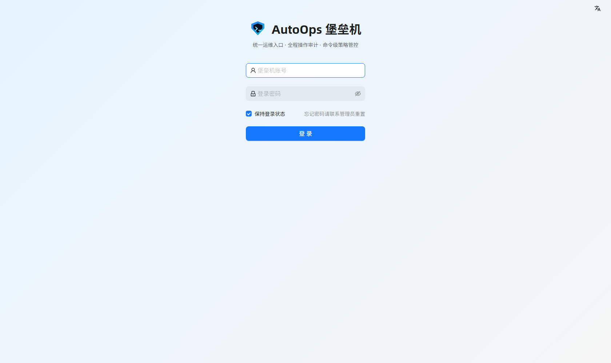

浏览器进 <http://localhost:8000>。第一次用 `admin / admin123` 登录，系统会**强制你改口令**
（这条在 `docs/审计与安全.md` 里有说明：初始口令不改不给进）。注意这里登录的是**堡垒机账号**，
不是目标机的账号 —— 目标机账号在后面「账号管理」里单独配，用户平时看不到它们的口令。

### ② 概览：一屏看清现状

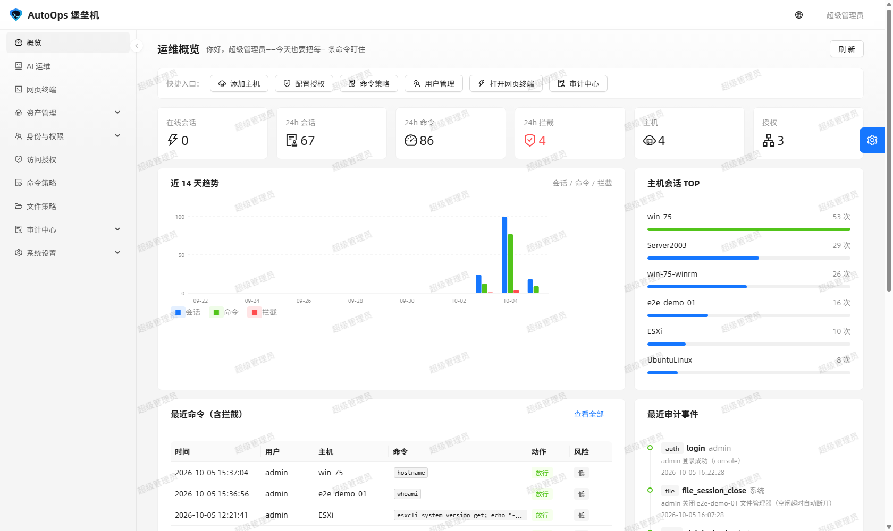

资产数、在线会话、风险提示、最近审计都在这。日常先去「审计中心」看异常，再去「资产管理」加机器。

---

## 二、把机器纳管进来

### ③ 资产管理 → 主机列表

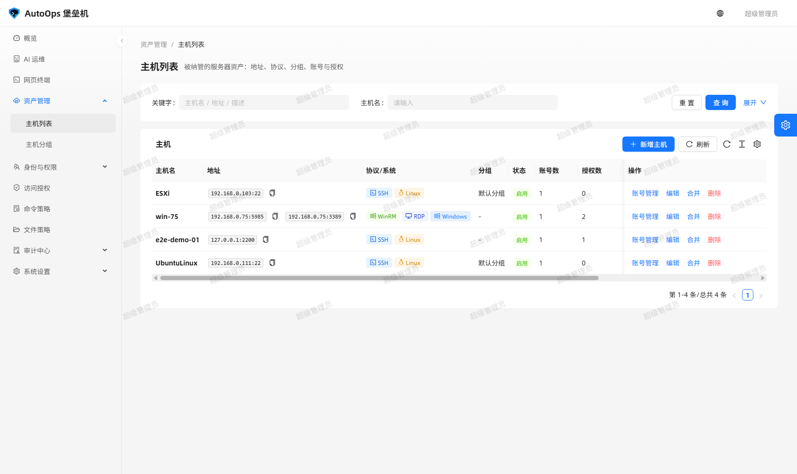

一台机器一行，**行里可以挂多个协议端点**：Linux 机器挂 `ssh:22`，Windows 机器可以同时挂
`winrm:5985` 和 `rdp:3389` —— 也就是说同一台 Windows 既能开字符终端（命令可审计），
也能开图形远程桌面（全程录像）。地址相同、只是协议不同的两条记录，可以用行里的
「合并」一键合成一台，账号与端点都会归并过去。

### ④ 编辑主机：协议入口与端口分开配

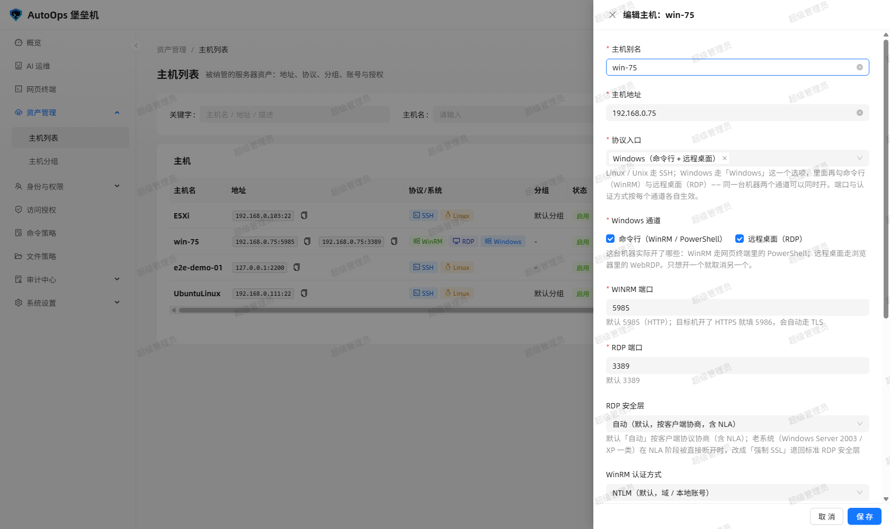

点行里的「编辑」拉出右侧抽屉：

- **协议入口**：Linux 选 `Linux / Unix（SSH 命令行）`；Windows 选 `Windows（命令行 + 远程桌面）`，
  勾上要开哪几个通道（命令行 WinRM / 远程桌面 RDP）。
- **每个协议各自的端口**：WinRM 默认 5985（目标机开了 HTTPS 就填 5986，会自动走 TLS），
  RDP 默认 3389，SSH 默认 22。
- **RDP 安全层**：默认「自动」（含 NLA）；老系统（Windows Server 2003 / XP 一类）在 NLA 阶段
  被直接断开时，改成「强制 SSL」。
- **账号**：切到「账号管理」加目标机账号（用户名 + 口令，口令在库里加密存放）。

---

## 三、身份与权限：谁能干什么

### ⑤ 用户管理：谁能登录堡垒机

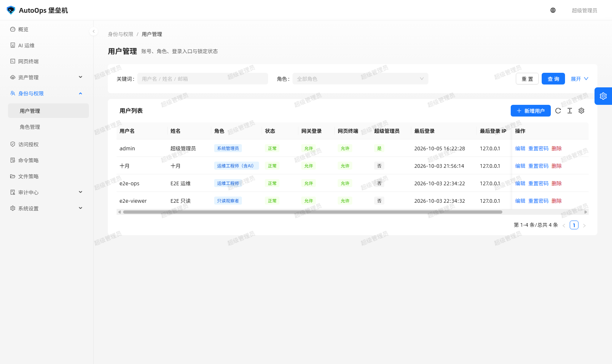

每个运维人员一个堡垒机账号（不是目标机账号）。用户属于哪个角色，决定他能看到哪些菜单、
能对哪些机器做什么 —— 前端菜单只是体验层，后端每个接口还会再校验一遍权限码。

### ⑥ 角色管理：权限是勾出来的

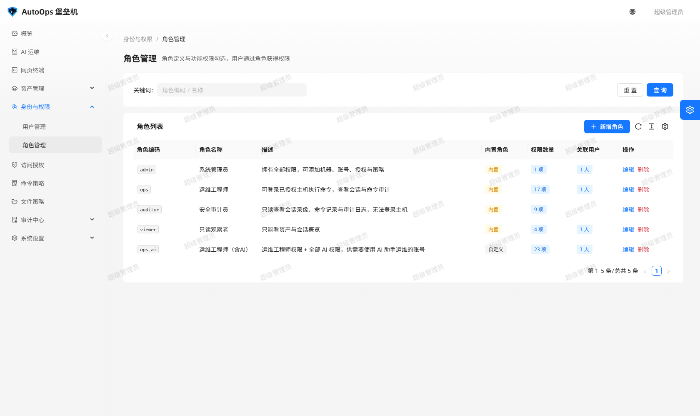

权限码按模块分组，典型的几条：能不能看资产、能不能开网页终端、能不能传文件、
能不能看录像、命令策略能不能改。**给最小集合**：只看不改的审计员，就别给「资产管理」的写权限。

### ⑦ 访问授权：谁 → 哪台机器 → 哪个账号

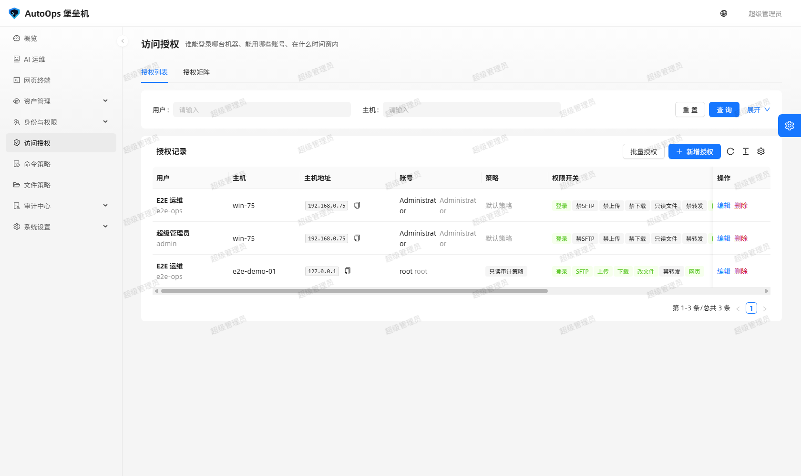

这是堡垒机的核心一张表。一条授权 = 某个用户（或角色）× 某台主机 × 某个账号，
再决定**能不能开网页终端**、**能不能用文件管理器**、**有没有时长与时段限制**。
没授权的机器，用户在网页终端列表和 SSH 网关菜单里**根本看不到**；就算手敲 `hostId`
直连，后端也会拒（审计里留下来一条拒绝记录）。

---

## 四、命令与文件策略

### ⑧ 命令策略：什么能敲、什么不能敲

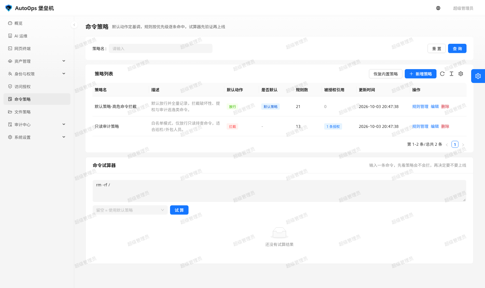

用正则 + 风险等级描述规则：命中「拒绝」的规则时命令**不发往目标机**，用户当场看到拒绝提示，
审计里记一条 `denied`；命中「需审批」的高危命令，可以要求管理员当场确认后才放行。
命令策略按用户/角色与主机范围生效，放行与拒绝都留痕。

> 文件策略（能不能碰某个路径、能不能上传下载）在菜单「文件策略」里，思路与命令策略一样，
> 作用在 SFTP 文件管理器上。

---

## 五、真正干活的四个入口

### ⑨ 网页终端：一台主机一行，按协议给入口

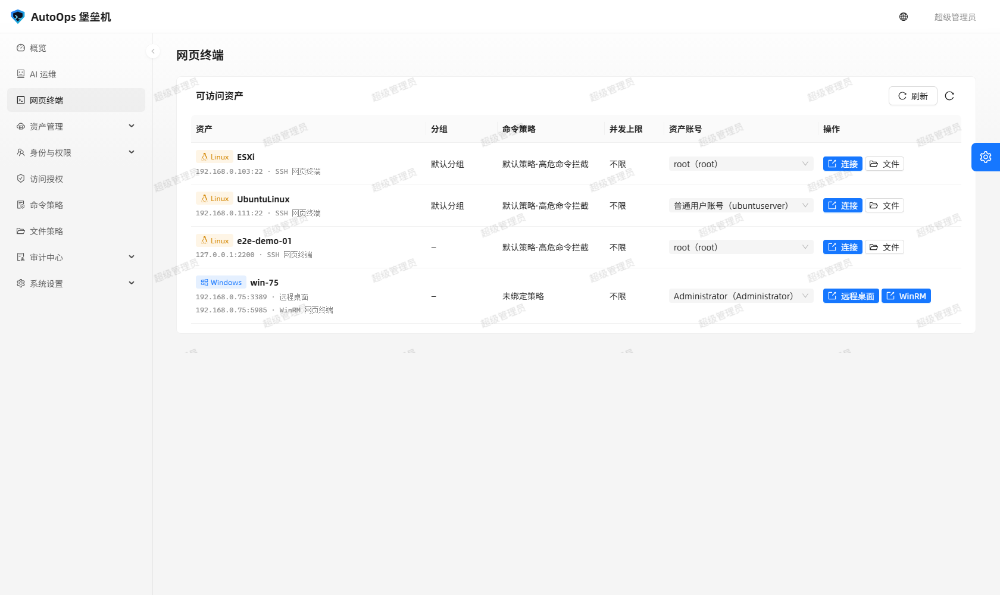

「网页终端」这一页把所有**你有权限**的主机列出来，同一台机器有几个协议就给你几个按钮：
Linux 给 SSH、Windows 给 WinRM / 远程桌面。点「连接」会**新开一个标签页**，
一个标签页一条会话。

### ⑩ 浏览器里连上 Linux 主机

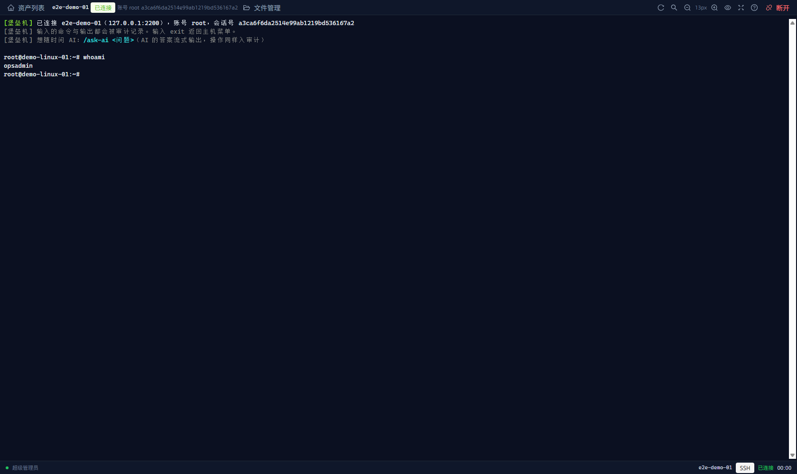

不用装任何客户端：浏览器里就是一个真终端。图里连的是演示目标机 `e2e-demo-01`，
敲了 `whoami` 返回 `opsadmin`。顶部状态条显示主机、登录账号与**会话号**，
右上角可以调字号、搜索回显、随时「断开」；底部状态条显示 `SSH · 已连接 · 耗时`。

> 在这个终端里输入的命令与回显**逐条进审计**。想边干活边问 AI：输入 `/ask-ai <问题>`。

### ⑪ 文件管理器：SFTP 也能在浏览器里用

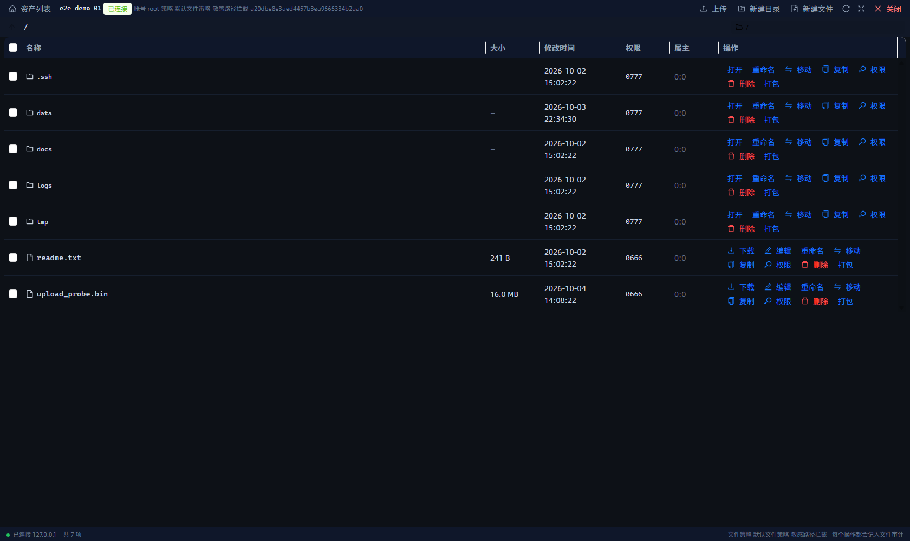

终端工具条点「文件管理」新开一个标签页：左边目录树、右边文件列表，
支持上传、下载、新建目录、改名、改权限、删除。**它走的是同一套授权与策略**：
没有文件权限的用户看不到这个按钮，路径不在允许范围内会被拦下并写审计。

### ⑫ Windows 主机也能开字符会话（WinRM）

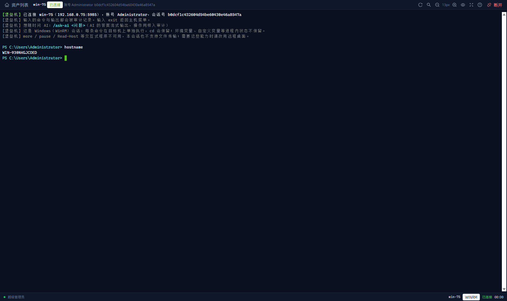

Windows 主机挂上 `winrm:5985` 端点后，用同一个「网页终端」入口就能开 PowerShell 会话
（图里敲 `hostname` 返回 `WIN-930NKGJCOED`）。它的语义与 Linux 不同，页面上会直接写清楚：

- 每条命令在目标机上**单独执行**，`cd` 会保留（会话里记住当前目录），
  环境变量、自定义变量这类**进程内状态不保留**；
- `more` / `pause` / `Read-Host` 等交互式程序不可用，本会话也不支持文件传输；
- 需要这些能力时改用远程桌面。

### ⑬ Windows 远程桌面：浏览器里操作，全程录像

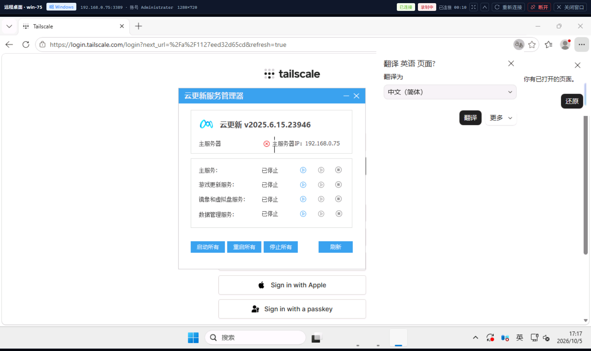

点 Windows 主机的「远程桌面」按钮，浏览器里直接出 Windows 桌面（图里是 `win-75`，
Windows Server 2025），右上角显示「**录制中**」与已连时长，可以重新连接、断开、关闭窗口。
录像落在服务端，之后在「审计中心 → 远程桌面录像」里回看。

> 远程桌面是图形协议，**命令级策略管不到它**，所以它的补偿措施是「全程录像 + 录像回看权限」。

---

## 六、事后审计：谁在什么时候做了什么

### ⑭ 远程桌面录像

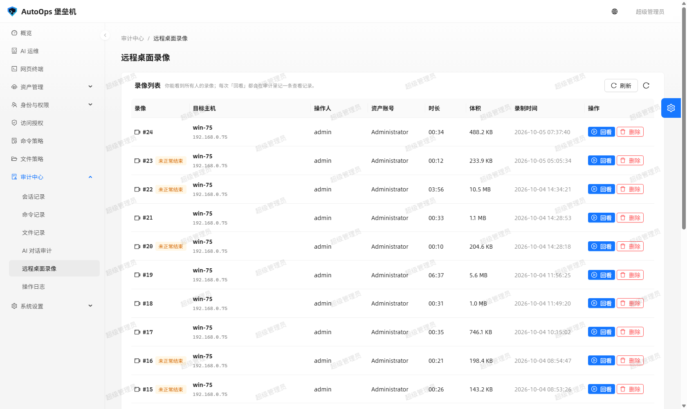

每个 RDP 会话一段录像，按主机、账号、时间筛。有权限的审计员看得到所有人的录像，
普通用户只看得到自己那部分（后端按权限过滤，不是前端藏一下）。

### ⑮ 命令记录：每条命令与输出都在

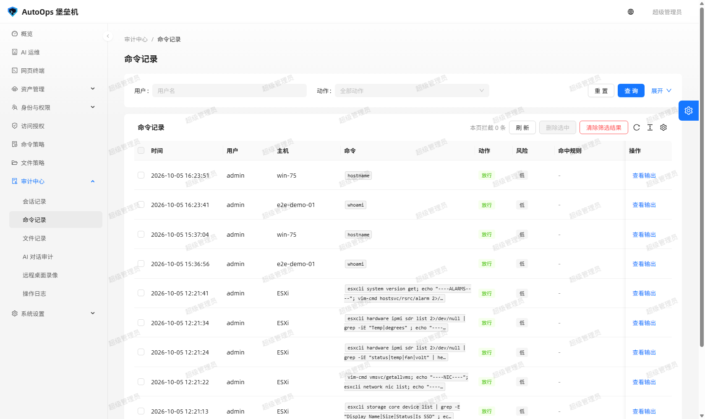

这是需求里最硬的一条：**每条命令与输出都被记录**。列表里能看到谁、在哪条会话、
什么时候、敲了什么、返回了什么、命中了哪条策略、是放行还是拒绝，点开看完整回显。

### ⑯ 会话记录

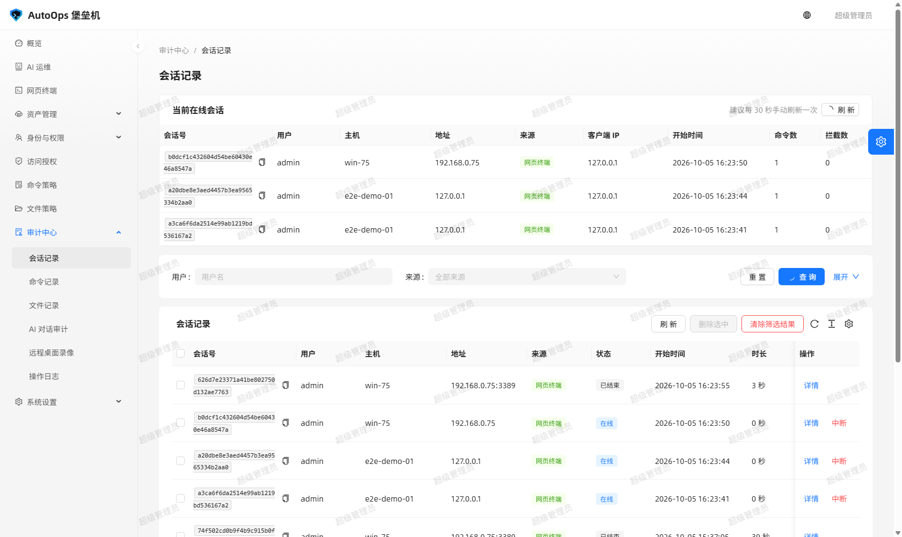

谁在什么时候从哪儿连了哪台机器、用的哪个账号、走了哪种协议（SSH / WinRM / RDP / SFTP）、
持续了多久、现在是否还在线。管理员可以对在线会话**强制中断**。

### ⑰ 操作日志与哈希链

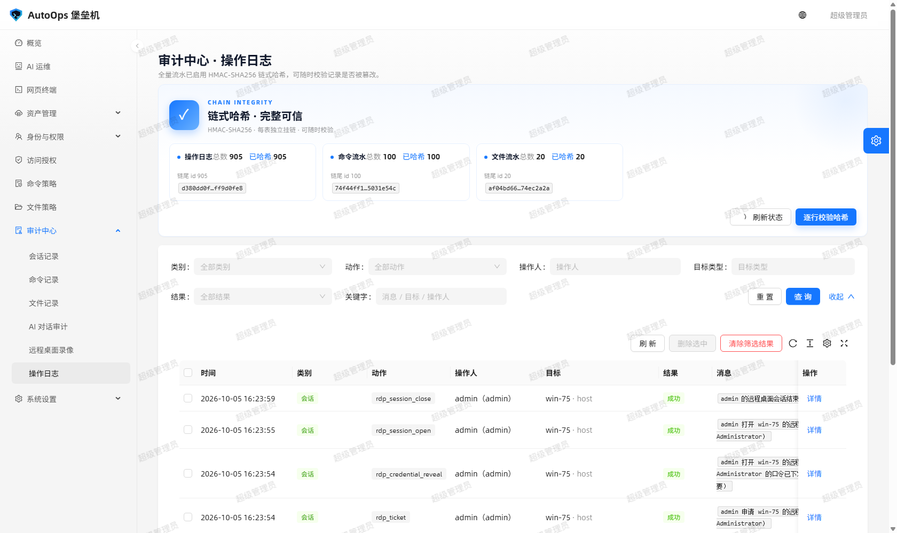

除了「谁连了机器」，还有「谁改了配置」：加机器、改授权、改策略、删用户，全在这里。
每条日志串进**哈希链**（上一条的哈希参与本条的计算），所以偷偷改一条历史记录，
链就断了 —— 用 `python tools/verify_audit_chain.py` 一验便知。

---

## 七、AI 运维助手

### ⑱ 自然语言下指令，敏感操作要人批


「AI 运维」里可以直接说人话，比如「看看 win-75 的磁盘还剩多少」。
AI 调用的每个工具（执行命令、查审计、开终端）都**受同一套权限与策略约束**：
命中高危策略的操作不会自己往下走，而是把确认请求推给管理员，由人当场点「同意 / 拒绝」；
对话、工具调用、审批结果全部进「审计中心 → AI 对话审计」。

---

## 八、SSH 网关：命令行入口

不想开网页也行 —— 家里/公司的终端直接 ssh 上来：

```bash
ssh -p 2222 <堡垒机账号>@<堡垒机IP>
```

登录后是一个**审计 shell**：你先看到「有权限的主机菜单」，选一台进去，之后的每条命令与输出
都照常记录。菜单、选择、回显都由堡垒机自己实现，所以**没有授权的机器连名字都不会出现**。

想确认网关端口与开关，管理员可以在「系统设置 → SSH 网关」看：


---

## 常见问题

| 现象 | 原因 / 处理 |
| --- | --- |
| 登录页报「接口 404 / 502」 | 后端没起或端口不对；`config/proxy.ts` 默认代理到 `127.0.0.1:5000`，换后端用 `BASTION_API=... npm run dev` |
| 网页终端一直「连接中」 | 代理没透传 WebSocket；`/socket.io/` 必须带 `Upgrade`、`Connection` 头（Nginx 见根 README「部署到生产」） |
| 页面样式是旧的 | 浏览器缓存；`Ctrl + F5` 强刷 |
| 列表里看不到某台机器 | 没给这台机器授权（或授权里没勾网页终端）；审计里会有对应拒绝记录 |
| 命令被拒 | 命中命令策略；在「命令策略」里看是哪条规则，拒绝原因在命令记录里 |
| Windows 连不上 | 目标机 WinRM 未启用 / 端口不对（5985 vs 5986）、RDP 安全层要改「强制 SSL」；先用主机行里的「测试连接」逐协议试 |

## 相关文档

- [使用手册](使用手册.md) —— 每个页面的字段与操作说明
- [审计与安全](审计与安全.md) —— 审计数据流、哈希链、口令与凭据的处理方式
- [需求对照](需求对照.md) —— 四条需求逐条对应到实现与验证
- [验证记录](验证记录.md) —— 门禁与真机联调的实测记录（含截图取证）
